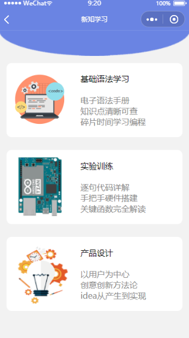

# Arduino 快速入门

> 本项目源于小学期创新实验。旨在辅助学生学习 [Arduino](https://github.com/arduino/Arduino)。

## **:hand:Have a try**

- 微信搜索 `Arduino快速入门`
- 或扫描以下小程序码


## Have a look

 

## 开发

下载 [微信开发者工具](https://developers.weixin.qq.com/miniprogram/dev/devtools/devtools.html)，导入本仓库。

## 项目结构

```md
.
├── README.md
├── miniprogram            // 小程序代码
├── pictures
└── project.config.json    // 小程序项目配置
```

## 技术相关

- [towxml](https://github.com/sbfkcel/towxml)

  微信小程序HTML、Markdown渲染库。将 markdown 格式数据转化为 wxml。

- [vant-weapp](https://github.com/youzan/vant-weapp)

  微信小程序 UI 组件库

- [WebSocket](https://developers.weixin.qq.com/miniprogram/dev/api/network/websocket/wx.sendSocketMessage.html)

  前后端 WebSocket 通信

## CHANGELOG

- 2020-10-30 移除腾讯云微信小程序解决方案 [wafer-node-sdk](https://github.com/tencentyun/wafer2-node-sdk)，代码重构
